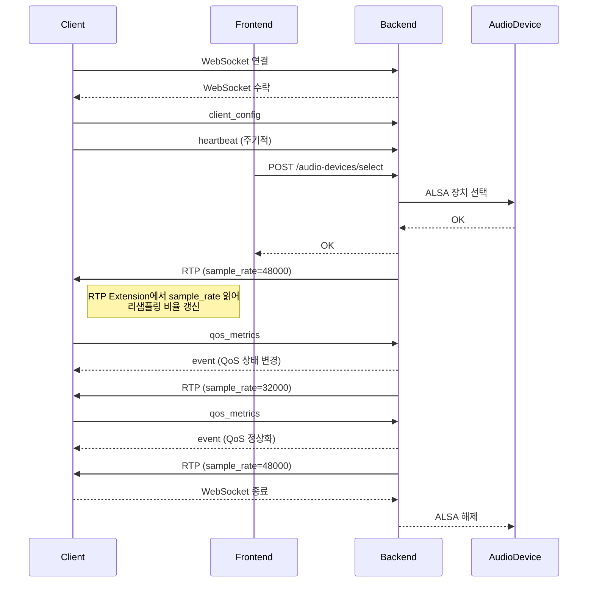

# M32 및 범용 오디오 인터페이스 기반 USB 오디오 송출 시스템 — 관리자 페이지 및 API 명세 (최종)

## 🎯 개요

- 리눅스에서 ALSA를 통해 USB 오디오 인터페이스(예: Midas M32) 캡처
- 멀티채널 오디오를 클라이언트(Android/iOS)로 저지연 송출
- 서버: 백엔드(Rust)와 프론트엔드(SPA) 완전 분리
- 클라이언트는 고정된 오디오 디바이스 샘플레이트로 재생
- 서버는 QoS 상태에 따라 클라이언트별 RTP 샘플레이트를 동적으로 조정
- 모든 RTP 패킷의 Extension에 sample_rate 포함
- QoS 상태와 시스템 상태는 SQLite(현상태) + 로그에 기록
- 관리자 페이지에서 장치, 채널, QoS, 시스템 자원까지 모니터링

## 🖥️ 관리자 페이지 설계

### 메뉴 구조

| 메뉴 | 설명 |
|------|------|
| **대시보드** | 클라이언트 및 서버 상태 요약 |
| **오디오 장치 관리** | ALSA 장치 목록 조회/선택 |
| **채널 매핑 설정** | 채널 이름, 순서, 활성화 관리 |
| **QoS 상태** | 클라이언트별 QoS 모니터링 |
| **시스템 정보** | 시스템 이름/버전/빌드일 확인 |
| **CPU/RAM 모니터링** | 서버 리소스 모니터링 |
| **로그 보기** | 최근 이벤트 및 에러 로그 확인 |

### UX 요소

✅ 각 페이지 데이터는 WebSocket + Polling 혼합으로 실시간 반영  
✅ CPU >80%, RAM >90% 시 경고 배너 표시  
✅ QoS 상태별 색상 구분 (정상: 녹색, 저하: 주황, 과부하: 빨강)  
✅ 장치 선택은 표와 라디오 버튼 형태  
✅ 채널 순서 변경은 드래그 앤 드롭 가능  
✅ 로그 페이지에는 검색 및 필터링 기능

## 🌐 API 요구사항

### HTTP REST API

#### 오디오 장치 관리
| 메서드 | 경로 | 설명 |
|--------|------|------|
| `GET` | `/audio-devices` | ALSA 장치 목록과 선택된 장치 |
| `POST` | `/audio-devices/select` | 장치 선택 |
| `GET` | `/audio-devices/current` | 현재 사용 중인 장치 정보 |

#### 채널 매핑
| 메서드 | 경로 | 설명 |
|--------|------|------|
| `GET` | `/audio-meta` | 시스템 정보 + 채널 기본값 |

#### QoS 상태
| 메서드 | 경로 | 설명 |
|--------|------|------|
| `GET` | `/qos-status` | 클라이언트별 QoS 상태 |
| `POST` | `/qos-metrics` | 클라이언트가 QoS 메트릭 보고 |

#### 시스템 정보
| 메서드 | 경로 | 설명 |
|--------|------|------|
| `GET` | `/system-info` | 시스템 이름, 버전, 빌드일 |

#### 시스템 모니터링
| 메서드 | 경로 | 설명 |
|--------|------|------|
| `GET` | `/system-stats` | CPU, 메모리, 네트워크 사용량 |

### WebSocket 메시지

#### 클라이언트 → 서버
| 타입 | 설명 |
|------|------|
| `heartbeat` | 30초마다 상태 보고 |
| `client_config` | 클라이언트 설정 전달 |
| `ntp_request` | 시계 동기화 요청 |
| `qos_metrics` | QoS 메트릭 보고 |

#### 서버 → 클라이언트
| 타입 | 설명 |
|------|------|
| `event` | 설정/QoS/에러 알림 |
| `ntp_response` | 시계 동기화 응답 |
| `qos_event` | QoS 상태 알림 |

### RTP

| 항목 | 설명 |
|------|------|
| 프로토콜 | UDP + RTP |
| 데이터 | 매핑된 채널 오디오 데이터 |
| 송출 | 서버 → 클라이언트 |
| 패킷 | 모든 패킷에 Extension 포함 |
| Extension 필드 | `sample_rate`, `server_time_ms`, `event_flags`, `reserved` |

## 📄 API 예시 응답

### `/audio-devices`
```json
{
  "devices": [
    { "id": "hw:0,0", "name": "HDA Intel", "description": "Built-in Audio" },
    { "id": "hw:2,0", "name": "Midas M32", "description": "USB Audio Interface" }
  ],
  "selected_device": "hw:2,0"
}
```

### `/qos-status`
```json
{
  "clients": [
    {
      "client_id": "client_001",
      "status": "degraded",
      "sample_rate": 32000,
      "latency_ms": 95,
      "jitter_ms": 7,
      "updated_at": "2025-07-17T13:12:00Z"
    }
  ]
}
```

### `/system-stats`
```json
{
  "cpu_usage_percent": 45.2,
  "memory_used_mb": 2450,
  "memory_total_mb": 8192,
  "network_in_mbps": 5.3,
  "network_out_mbps": 4.7,
  "timestamp": "2025-07-17T14:00:00Z"
}
```

## 🧪 Sequence Diagram



## 🔷 요약

✅ 클라이언트는 연결을 유지하며 RTP 패킷의 Extension으로 sample_rate를 동적으로 리샘플링  
✅ QoS 상태는 클라이언트별, 임시적이며 SQLite(현재 상태) + 로그에 저장  
✅ 관리자 페이지에서는 장치, 채널, QoS, CPU/RAM, 로그를 모니터링 및 제어  
✅ 백엔드와 프론트엔드는 완전히 분리되어 동작

